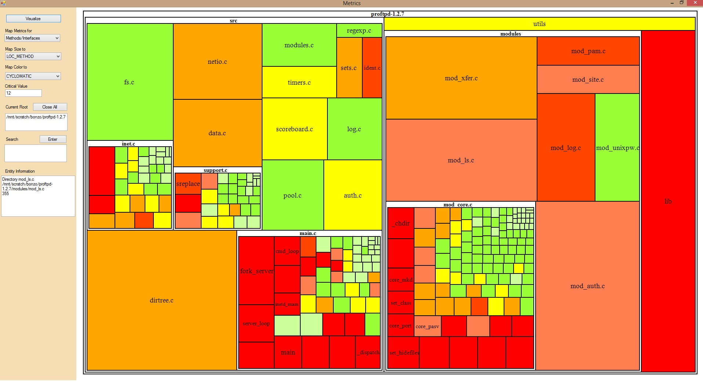
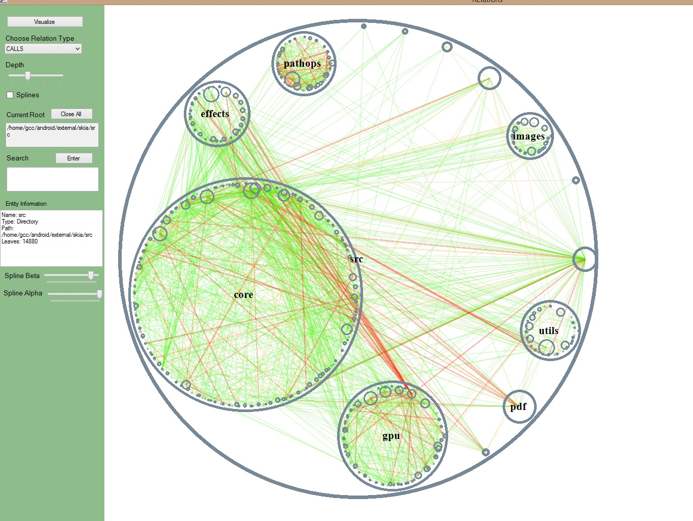

# CodeAnalysisVisualization-2014
Some techniques of visualizing results of static code analysis.

Static code analysis is the analysis of computer software that is performed without actually executing programs. It can be used when you want to examine your code for difficulty,to find vulnerabilities, to get a better understanding how parts of code are connected with each other 

# Plan:
1. Parsing text files with the results of static code analysis (~500Mb).
2. Building database for metrics and relations of code
3. Visualizing Metrics (Temperature Map)
4. Visualizing Relations (Circle Graph)

# Instruments:
Visual Studio 2010 - C#

# Results:

